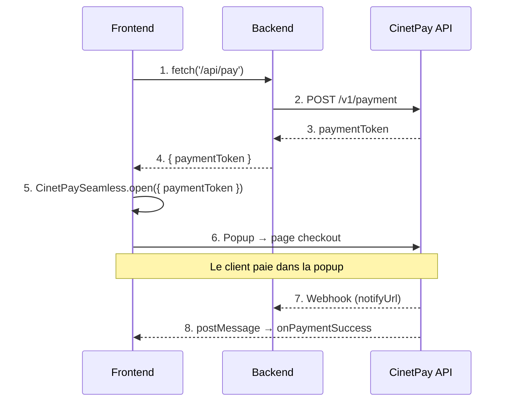
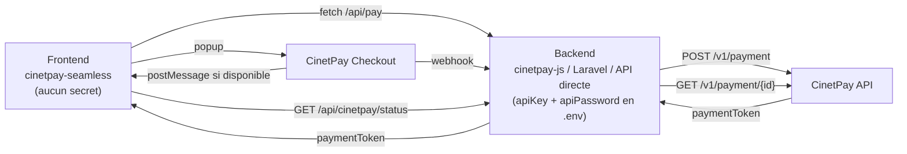

# cinetpay-seamless

CinetPay Seamless — paiement inline sans redirection pour applications web.

Ouvre la passerelle de paiement CinetPay dans une popup. L'utilisateur reste sur votre page. Le client ne quitte jamais votre site.

## Comment ça marche

1. Votre **backend** initialise le paiement via l'API CinetPay (`POST /v1/payment`) et obtient un `paymentToken`
2. Votre **frontend** passe ce token au Seamless qui ouvre la popup de paiement
3. Le client paie dans la popup — votre backend reçoit la confirmation via webhook



## Installation

```bash
npm install cinetpay-seamless
```

### CDN

```html
<script src="https://unpkg.com/cinetpay-seamless@0.1.2/dist/cinetpay-seamless.umd.cjs"></script>
```

## Démarrage rapide

```typescript
import { CinetPaySeamless } from 'cinetpay-seamless'

// 1. Obtenir le paymentToken depuis votre backend
const { paymentToken } = await fetch('/api/pay', {
  method: 'POST',
  headers: { 'Content-Type': 'application/json' },
  body: JSON.stringify({ amount: 5000, orderId: 'ORDER-001' }),
}).then(r => r.json())

// 2. Ouvrir la popup
CinetPaySeamless.open({
  paymentToken,
  onPaymentSuccess: (data) => {
    console.log('Paiement réussi !', data.amount, data.currency)
  },
  onPaymentFailed: (data) => {
    console.log('Paiement refusé')
  },
})
```

## CDN / Vanilla JS

```html
<button id="pay-btn">Payer 5 000 XOF</button>

<script src="https://unpkg.com/cinetpay-seamless@0.1.2/dist/cinetpay-seamless.umd.cjs"></script>
<script>
  document.getElementById('pay-btn').addEventListener('click', function() {
    // Appeler votre backend pour obtenir le paymentToken
    fetch('/api/pay', {
      method: 'POST',
      headers: { 'Content-Type': 'application/json' },
      body: JSON.stringify({ amount: 5000 })
    })
    .then(function(res) { return res.json() })
    .then(function(data) {
      CinetPaySeamless.open({
        paymentToken: data.paymentToken,
        onPaymentSuccess: function(result) {
          alert('Merci ! ' + result.amount + ' ' + result.currency)
        },
        onPaymentFailed: function() {
          alert('Paiement échoué')
        },
      })
    })
  })
</script>
```

## Event Listeners (style événementiel)

En plus des callbacks dans `open()`, écoutez les événements globalement :

```typescript
import { CinetPaySeamless } from 'cinetpay-seamless'

// Enregistrer les listeners AVANT d'ouvrir la popup
CinetPaySeamless.on('ready', () => {
  console.log('Passerelle chargée')
})

CinetPaySeamless.on('payment.success', (data) => {
  console.log('Payé !', data.amount, data.currency)
})

CinetPaySeamless.on('payment.failed', (data) => {
  console.log('Refusé', data.transactionId)
})

CinetPaySeamless.on('payment.pending', (data) => {
  console.log('En attente...', data.status)
})

CinetPaySeamless.on('close', ({ status }) => {
  console.log('Modal fermé:', status)
})

CinetPaySeamless.on('error', (err) => {
  console.error(err.code, err.message)
})

// Ouvrir — les listeners sont déjà en place
CinetPaySeamless.open({ paymentToken: 'votre-payment-token-ici' })
```

### Désabonnement

```typescript
// on() retourne une fonction de désabonnement
const unsubscribe = CinetPaySeamless.on('payment.success', handler)
unsubscribe()

// Ou avec off()
CinetPaySeamless.off('payment.success', handler)

// once() — appelé une seule fois
CinetPaySeamless.once('payment.success', (data) => { ... })
```

## API

### `CinetPaySeamless.open(config)`

Ouvre la popup de paiement CinetPay.

| Option | Type | Default | Description |
|---|---|---|---|
| `paymentToken` | `string` | **requis** | Token obtenu via votre backend (`POST /v1/payment`) |
| `statusUrl` | `string \| (ctx) => string` | - | Endpoint de votre backend pour vérifier le statut canonique |
| `checkStatus` | `(ctx) => Promise<object>` | - | Fonction personnalisée de vérification statut |
| `statusPollInterval` | `number` | `3000` | Intervalle de vérification statut en ms |
| `debug` | `boolean` | `false` | Logs console `[CinetPay Seamless]` |
| `onReady` | `() => void` | - | Iframe chargée |
| `onPaymentSuccess` | `(data) => void` | - | Paiement accepté |
| `onPaymentFailed` | `(data) => void` | - | Paiement refusé |
| `onPaymentPending` | `(data) => void` | - | En attente (PENDING, INITIATED, EXPIRED) |
| `onClose` | `({ status }) => void` | - | Modal fermé |
| `onError` | `(error) => void` | - | Erreur technique |

### `CinetPaySeamless.on(event, handler)`

| Événement | Donnée | Description |
|---|---|---|
| `ready` | — | Iframe chargée |
| `payment.success` | `PaymentResponse` | Paiement accepté |
| `payment.failed` | `PaymentResponse` | Paiement refusé |
| `payment.pending` | `PaymentResponse` | En attente |
| `close` | `{ status: string }` | Modal fermé |
| `error` | `PaymentError` | Erreur technique |

### `CinetPaySeamless.off(event, handler)`

Supprime un listener.

### `CinetPaySeamless.once(event, handler)`

Listener appelé une seule fois.

### `CinetPaySeamless.close()`

Ferme la popup et l'overlay.

### PaymentResponse

```typescript
{
  amount: number
  currency: string
  status: 'ACCEPTED' | 'REFUSED' | 'PENDING' | 'INITIATED' | 'EXPIRED' | 'UNKNOWN'
  rawStatus?: string
  apiCode?: number
  paymentMethod: string
  description: string
  transactionId: string
  metadata?: string
  operatorId?: string
  paymentDate?: string
}
```

### Vérification statut recommandée

Le checkout CinetPay peut finaliser le paiement sans envoyer de `postMessage`
au parent navigateur. Pour fiabiliser `onPaymentSuccess` et `onPaymentFailed`,
fournissez un endpoint backend qui vérifie le statut canonique auprès de CinetPay.

```typescript
CinetPaySeamless.open({
  paymentToken,
  statusUrl: `/api/cinetpay/status?transactionId=${merchantTransactionId}`,
  statusPollInterval: 3000,
  onPaymentSuccess: (data) => {
    console.log('Paiement accepté', data.transactionId)
  },
  onPaymentFailed: (data) => {
    console.log('Paiement refusé', data.rawStatus)
  },
})
```

Votre endpoint backend doit appeler `GET /v1/payment/{merchant_transaction_id}`
avec vos clés CinetPay, puis renvoyer la réponse JSON au frontend :

```json
{
  "code": 100,
  "status": "SUCCESS",
  "merchant_transaction_id": "ORDER-123",
  "transaction_id": "27ba5590f3ae4c6f9585ae1e4f5265dd"
}
```

Le SDK normalise automatiquement :

| Statut CinetPay | Event Seamless |
|---|---|
| `SUCCESS` / code `100` | `payment.success` |
| `FAILED` / `INSUFFICIENT_BALANCE` / code `2010` / `2005` | `payment.failed` |
| `INITIATED` / `PENDING` / `EXPIRED` | `payment.pending` |

## Exemples d'intégration

> Le Seamless a besoin d'un `paymentToken` obtenu côté serveur. Les exemples ci-dessous
> utilisent `cinetpay-js` (Node.js), mais vous pouvez utiliser n'importe quel langage/SDK :
> `cinetpay-laravel-sdk` (PHP), un appel API direct (Python, Go, Ruby, etc.), ou tout autre outil
> qui appelle `POST /v1/payment` sur l'API CinetPay.

### Node.js (cinetpay-js) + Frontend (Seamless)

**Backend — Express :**
```typescript
import express from 'express'
import { CinetPayClient } from 'cinetpay-js'

const app = express()
app.use(express.json())

const client = new CinetPayClient({
  credentials: {
    CI: {
      apiKey: process.env.CINETPAY_API_KEY_CI!,
      apiPassword: process.env.CINETPAY_API_PASSWORD_CI!,
    },
  },
})

app.post('/api/pay', async (req, res) => {
  const { amount, orderId, email, firstName, lastName, phone } = req.body

  const payment = await client.payment.initialize({
    currency: 'XOF',
    merchantTransactionId: orderId,
    amount,
    lang: 'fr',
    designation: `Commande ${orderId}`,
    clientEmail: email,
    clientFirstName: firstName,
    clientLastName: lastName,
    clientPhoneNumber: phone,
    successUrl: `${process.env.APP_URL}/success`,
    failedUrl: `${process.env.APP_URL}/failed`,
    notifyUrl: `${process.env.APP_URL}/api/webhook`,
    channel: 'PUSH',
  }, 'CI')

  res.json({ paymentToken: payment.paymentToken })
})
```

**Frontend :**
```typescript
import { CinetPaySeamless } from 'cinetpay-seamless'

async function pay(amount: number) {
  const res = await fetch('/api/pay', {
    method: 'POST',
    headers: { 'Content-Type': 'application/json' },
    body: JSON.stringify({
      amount,
      orderId: `CMD-${Date.now()}`,
      email: 'client@email.com',
      firstName: 'Jean',
      lastName: 'Dupont',
      phone: '+2250707000000',
    }),
  })
  const { paymentToken } = await res.json()

  CinetPaySeamless.open({ paymentToken, debug: true })
}
```

### PHP / Laravel (cinetpay-laravel-sdk)

```php
// routes/api.php
Route::post('/pay', function (Request $request) {
    $payment = CinetPay::payment()->initialize([
        'currency' => 'XOF',
        'merchant_transaction_id' => 'CMD-' . time(),
        'amount' => $request->amount,
        'lang' => 'fr',
        'designation' => 'Commande ' . $request->orderId,
        'client_email' => $request->email,
        'client_first_name' => $request->firstName,
        'client_last_name' => $request->lastName,
        'success_url' => config('app.url') . '/success',
        'failed_url' => config('app.url') . '/failed',
        'notify_url' => config('app.url') . '/api/webhook',
        'channel' => 'PUSH',
    ], 'CI');

    return response()->json(['paymentToken' => $payment->paymentToken]);
});
```

### API directe (n'importe quel langage)

```bash
# 1. Authentification
TOKEN=$(curl -s -X POST https://api.cinetpay.net/v1/oauth/login \
  -H "Content-Type: application/json" \
  -d '{"api_key":"sk_test_...","api_password":"..."}' \
  | jq -r '.access_token')

# 2. Initialisation du paiement
PAYMENT_TOKEN=$(curl -s -X POST https://api.cinetpay.net/v1/payment \
  -H "Content-Type: application/json" \
  -H "Authorization: Bearer $TOKEN" \
  -d '{
    "currency": "XOF",
    "merchant_transaction_id": "CMD-'$(date +%s)'",
    "amount": 5000,
    "lang": "fr",
    "designation": "Commande",
    "client_email": "client@email.com",
    "client_first_name": "Jean",
    "client_last_name": "Dupont",
    "success_url": "https://monsite.com/success",
    "failed_url": "https://monsite.com/failed",
    "notify_url": "https://monsite.com/webhook",
    "channel": "PUSH",
    "direct_pay": false
  }' | jq -r '.payment_token')

# 3. Passer $PAYMENT_TOKEN au frontend
echo "paymentToken: $PAYMENT_TOKEN"
```

### Next.js (App Router)

**`app/api/pay/route.ts` :**
```typescript
import { CinetPayClient } from 'cinetpay-js'
import { NextResponse } from 'next/server'

const client = new CinetPayClient({
  credentials: {
    CI: {
      apiKey: process.env.CINETPAY_API_KEY_CI!,
      apiPassword: process.env.CINETPAY_API_PASSWORD_CI!,
    },
  },
})

export async function POST(req: Request) {
  const { amount, orderId, email, firstName, lastName, phone } = await req.json()

  const payment = await client.payment.initialize({
    currency: 'XOF',
    merchantTransactionId: orderId,
    amount,
    lang: 'fr',
    designation: `Commande ${orderId}`,
    clientEmail: email,
    clientFirstName: firstName,
    clientLastName: lastName,
    clientPhoneNumber: phone,
    successUrl: `${process.env.APP_URL}/orders/${orderId}/success`,
    failedUrl: `${process.env.APP_URL}/orders/${orderId}/failed`,
    notifyUrl: `${process.env.APP_URL}/api/webhook`,
    channel: 'PUSH',
  }, 'CI')

  return NextResponse.json({ paymentToken: payment.paymentToken })
}
```

**`app/checkout/page.tsx` :**
```tsx
'use client'
import { useEffect } from 'react'
import { CinetPaySeamless } from 'cinetpay-seamless'

export default function CheckoutPage() {
  useEffect(() => {
    const unsub = CinetPaySeamless.on('payment.success', (data) => {
      window.location.href = `/orders/${data.transactionId}/success`
    })
    return unsub
  }, [])

  const handlePay = async () => {
    const res = await fetch('/api/pay', {
      method: 'POST',
      headers: { 'Content-Type': 'application/json' },
      body: JSON.stringify({
        amount: 5000,
        orderId: `CMD-${Date.now()}`,
        email: 'client@email.com',
        firstName: 'Jean',
        lastName: 'Dupont',
        phone: '+2250707000000',
      }),
    })
    const { paymentToken } = await res.json()
    CinetPaySeamless.open({ paymentToken, debug: true })
  }

  return <button onClick={handlePay}>Payer 5 000 XOF</button>
}
```

### React

```tsx
import { useEffect, useState } from 'react'
import { CinetPaySeamless } from 'cinetpay-seamless'

function PayButton({ amount }: { amount: number }) {
  const [status, setStatus] = useState<'idle' | 'loading' | 'success' | 'error'>('idle')

  useEffect(() => {
    const unsub1 = CinetPaySeamless.on('payment.success', () => setStatus('success'))
    const unsub2 = CinetPaySeamless.on('payment.failed', () => setStatus('error'))
    const unsub3 = CinetPaySeamless.on('close', () => setStatus('idle'))
    return () => { unsub1(); unsub2(); unsub3() }
  }, []) // Pas de deps — les listeners sont stables

  const handlePay = async () => {
    setStatus('loading')
    const res = await fetch('/api/pay', {
      method: 'POST',
      headers: { 'Content-Type': 'application/json' },
      body: JSON.stringify({ amount }),
    })
    const { paymentToken } = await res.json()
    CinetPaySeamless.open({ paymentToken })
  }

  return (
    <div>
      <button onClick={handlePay} disabled={status === 'loading'}>
        {status === 'loading' ? 'Chargement...' : `Payer ${amount} XOF`}
      </button>
      {status === 'success' && <p>Paiement réussi !</p>}
      {status === 'error' && <p>Paiement échoué</p>}
    </div>
  )
}
```

### Vue 3

```vue
<script setup lang="ts">
import { onMounted, onUnmounted, ref } from 'vue'
import { CinetPaySeamless } from 'cinetpay-seamless'

const status = ref<'idle' | 'loading' | 'success' | 'error'>('idle')
let unsubs: (() => void)[] = []

onMounted(() => {
  unsubs.push(
    CinetPaySeamless.on('payment.success', () => { status.value = 'success' }),
    CinetPaySeamless.on('payment.failed', () => { status.value = 'error' }),
    CinetPaySeamless.on('close', () => { if (status.value === 'loading') status.value = 'idle' }),
  )
})

onUnmounted(() => unsubs.forEach(u => u()))

async function pay() {
  status.value = 'loading'
  const res = await fetch('/api/pay', {
    method: 'POST',
    headers: { 'Content-Type': 'application/json' },
    body: JSON.stringify({ amount: 5000 }),
  })
  const { paymentToken } = await res.json()
  CinetPaySeamless.open({ paymentToken })
}
</script>

<template>
  <button @click="pay" :disabled="status === 'loading'">
    {{ status === 'loading' ? 'Chargement...' : 'Payer 5 000 XOF' }}
  </button>
  <p v-if="status === 'success'">Paiement réussi !</p>
  <p v-if="status === 'error'">Paiement échoué</p>
</template>
```

### Formulaire HTML complet

```html
<!DOCTYPE html>
<html lang="fr">
<head>
  <meta charset="UTF-8">
  <meta name="viewport" content="width=device-width, initial-scale=1.0">
  <title>Paiement</title>
  <script src="https://unpkg.com/cinetpay-seamless@0.1.2/dist/cinetpay-seamless.umd.cjs"></script>
</head>
<body>
  <form id="payment-form">
    <input type="text" id="firstName" required placeholder="Prénom">
    <input type="text" id="lastName" required placeholder="Nom">
    <input type="email" id="email" required placeholder="Email">
    <input type="tel" id="phone" required placeholder="+2250707000000">
    <input type="number" id="amount" value="5000" min="100">
    <button type="submit" id="payBtn">Payer</button>
  </form>

  <div id="status"></div>

  <script>
    CinetPaySeamless.on('payment.success', function(data) {
      document.getElementById('status').textContent = 'Payé ! ' + data.amount + ' ' + data.currency
      document.getElementById('payBtn').disabled = false
    })

    CinetPaySeamless.on('payment.failed', function() {
      document.getElementById('status').textContent = 'Paiement refusé'
      document.getElementById('payBtn').disabled = false
    })

    CinetPaySeamless.on('close', function() {
      document.getElementById('payBtn').disabled = false
    })

    document.getElementById('payment-form').addEventListener('submit', function(e) {
      e.preventDefault()
      document.getElementById('payBtn').disabled = true

      // Appeler votre backend pour obtenir le paymentToken
      fetch('/api/pay', {
        method: 'POST',
        headers: { 'Content-Type': 'application/json' },
        body: JSON.stringify({
          amount: parseInt(document.getElementById('amount').value),
          firstName: document.getElementById('firstName').value,
          lastName: document.getElementById('lastName').value,
          email: document.getElementById('email').value,
          phone: document.getElementById('phone').value,
        })
      })
      .then(function(res) { return res.json() })
      .then(function(data) {
        CinetPaySeamless.open({ paymentToken: data.paymentToken, debug: true })
      })
      .catch(function(err) {
        document.getElementById('status').textContent = 'Erreur: ' + err.message
        document.getElementById('payBtn').disabled = false
      })
    })
  </script>
</body>
</html>
```

### Gestion d'erreur complète

```typescript
CinetPaySeamless.on('ready', () => {
  disablePayButton() // Empêcher les doubles clics
})

CinetPaySeamless.on('payment.success', (data) => {
  showToast('success', `${data.amount} ${data.currency} payés !`)
  redirectTo(`/orders/${data.transactionId}/success`)
})

CinetPaySeamless.on('payment.failed', () => {
  showToast('error', 'Le paiement a été refusé.')
  enablePayButton()
})

CinetPaySeamless.on('payment.pending', (data) => {
  showToast('info', `En attente (${data.status})...`)
})

CinetPaySeamless.on('error', (err) => {
  showToast('error', `Erreur: ${err.message}`)
  enablePayButton()
})

CinetPaySeamless.on('close', ({ status }) => {
  if (status === 'UNKNOWN') {
    showToast('warning', 'Paiement annulé.')
  }
  enablePayButton()
})
```

## Debug

```typescript
CinetPaySeamless.open({ paymentToken: 'abc...', debug: true })
```

```
[CinetPay Seamless] CinetPaySeamless.open() called
[CinetPay Seamless] Opening popup { paymentUrl: 'https://secure.cinetpay.net/checkout/abc...' }
[CinetPay Seamless] Iframe loaded — checkout ready
[CinetPay Seamless] Payment response: ACCEPTED { amount: 5000, currency: 'XOF', ... }
[CinetPay Seamless] Payment accepted
[CinetPay Seamless] Modal closed { lastStatus: 'ACCEPTED' }
```

## Sécurité

### Protection des clés API

Les clés API (`apiKey` / `apiPassword`) ne sont **jamais** utilisées côté frontend. Le Seamless reçoit uniquement un `paymentToken` opaque et à usage unique, généré par votre backend.

```
NE FAITES PAS                              FAITES
────────────────────────────────────────────────────────────────────────
Mettre apiKey dans le code frontend        Initialiser le paiement côté serveur
Exposer apiPassword dans le JavaScript     Passer uniquement le paymentToken au frontend
Stocker les clés dans le code source       Utiliser des variables d'environnement (.env)
Utiliser les mêmes clés partout            Clés sandbox (sk_test_) en dev, prod (sk_live_) en prod
Partager vos clés par email/chat           Utiliser un gestionnaire de secrets
Commiter le .env dans git                  Ajouter .env dans .gitignore
```

### Environnements

| Préfixe de clé | Environnement | Usage |
|---|---|---|
| `sk_test_...` | Sandbox (`api.cinetpay.net`) | Développement et tests |
| `sk_live_...` | Production (`api.cinetpay.co`) | Transactions réelles |

**Règles importantes :**
- Ne **jamais** utiliser des clés `sk_live_` en développement
- Ne **jamais** mélanger des clés `sk_test_` et `sk_live_` dans le même environnement
- Les SDKs backend (cinetpay-js, cinetpay-laravel-sdk) détectent automatiquement l'environnement depuis le préfixe de la clé
- En cas de compromission, changez immédiatement vos clés depuis le dashboard CinetPay

### Architecture recommandée



### Autres protections

- **postMessage** : whitelist stricte des domaines CinetPay (bloque les domaines lookalike)
- **statusUrl recommandé** : vérification canonique via votre backend si `postMessage` final absent
- **paymentToken validé** : regex `[a-zA-Z0-9_-]{10,128}` avant injection dans l'URL
- **Popup bloquée** : détection et callback `onError` avec code `POPUP_BLOCKED`
- **Zero dépendance** runtime — aucun risque supply chain

## Support

Pour toute question : **support@cinetpay.com**

## Licence

MIT
